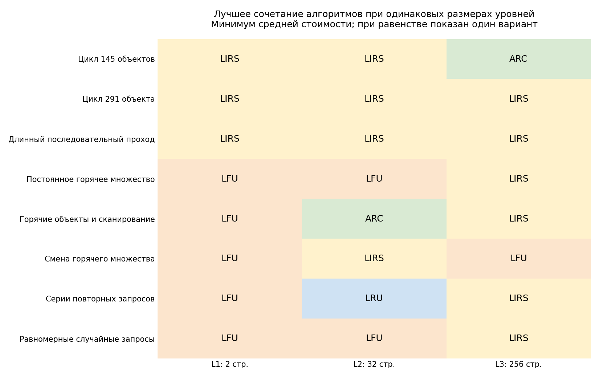

# Cache Research

Исследование алгоритмов вытеснения **LRU, LFU, ARC, 2Q и LIRS**: как размер
кеша и характер запросов влияют на выбор алгоритма и когда выгодно делить
память на несколько уровней. Ниже — основные графики и результаты трёх
экспериментов; инструкции сборки и воспроизведения находятся после них.

[Одноуровневый кеш](#одноуровневый-кеш) ·
[Процессорная иерархия](#процессорная-иерархия) ·
[Бесплатный доступ к уровням](#бесплатный-доступ-к-уровням) ·
[Сборка и запуск](#сборка-и-запуск)

Во всех опытах объекты одинакового размера, кеши изначально пусты, первые
загрузки учитываются. Вместимость не включает память служебных структур.
Сравнение проводится на одинаковых искусственных запросах.
**Горячее множество** — набор часто запрашиваемых объектов.
**REF** — идеальный алгоритм, знающий будущие запросы; он служит ориентиром.
Во всех приведённых метриках **меньше — лучше**.

## Одноуровневый кеш

**Вопрос:** какой алгоритм выбрать при заданной вместимости и нагрузке?
Проверены 30 размеров и 10 видов запросов: по 20 000 обращений и пять
начальных значений генератора. Метрика — среднее число загрузок из источника
на 1000 запросов; время поиска в кеше не учитывается.

На графиках по горизонтали — вместимость в логарифмическом масштабе,
по вертикали — загрузки на 1000 запросов. Пунктир обозначает REF.


**Победители при трёх характерных размерах.** В ячейке указаны алгоритмы
и загрузки на 1000 запросов. При равенстве перечислены все победители.

| Запросы | 32 объекта | 64 объекта | 290 объектов |
|---|---|---|---|
| Цикл 145 объектов | LIRS — 787.65 | LIRS — 568.45 | ARC, LFU, LIRS, LRU — 7.25 |
| Цикл 291 объекта | LIRS — 894.60 | LIRS — 785.80 | LIRS — 24.60 |
| Длинный последовательный проход | LIRS — 973.65 | LIRS — 946.45 | LIRS — 755.60 |
| Постоянное горячее множество | LFU — 212.66 | LFU — 99.56 | LFU — 81.27 |
| Горячие объекты и сканирование | LIRS — 333.21 | ARC, LFU, LIRS — 251.40 | ARC, LFU, LIRS, LRU — 251.40 |
| Смена горячего множества | LIRS — 236.64 | LRU — 117.22 | LFU — 94.37 |
| Серии повторных запросов | ARC, LIRS, LRU — 60.51 | LFU — 58.91 | LFU — 48.84 |
| Равномерные случайные запросы | ARC — 971.68 | ARC — 944.50 | LIRS — 752.16 |
| Неравномерная популярность | LFU — 502.77 | LFU — 420.39 | LFU — 224.34 |
| Переходы между страницами | LRU — 521.20 | LRU — 271.60 | LFU — 201.00 |

**Вывод.** Универсального победителя нет: при смене горячего множества
с увеличением вместимости лучший алгоритм меняется с LIRS на LRU, затем
на LFU. При постоянном горячем множестве LFU выигрывает во всех трёх
столбцах. Размер кеша нужно выбирать вместе с алгоритмом под конкретные запросы.
Малые различия средних по пяти запускам не доказывают устойчивого преимущества.

[Подробные результаты](cacheBenchmarks/reports/software.md) ·
[Все размеры и измерения](cacheBenchmarks/reports/software/summary.csv)

## Процессорная иерархия

**Вопрос:** как распределить память и алгоритмы между тремя уровнями?
Общий объём — 290 страниц, ограничения: L1 ≤ 4, L2 ≤ 64, L3 ≤ 256.
Проверены восемь разбиений и восемь видов запросов, по 20 000 обращений
и пять начальных значений генератора.

Обращения к L1, L2 и L3 стоят 1, 3 и 10 условных единиц, загрузка из памяти —
ещё 50. Затраты складываются: попадание в L3 стоит 14, полный промах — 64.
Метрика — **средняя стоимость запроса**, а не измеренная задержка процессора.

На диаграмме размеры фиксированы: **2+32+256**. Каждая строка показывает
одно лучшее сочетание целиком: нижний уровень получает только промахи верхнего,
поэтому алгоритмы на уровнях нельзя выбирать независимо.



**Победители среди всех проверенных разбиений** приведены ниже; их размеры
могут отличаться от фиксированного разбиения на диаграмме. При равенстве
показан один из лучших вариантов. Алгоритмы перечислены от L1 к L3.

| Запросы | L1+L2+L3, страниц | Алгоритмы L1+L2+L3 | Средняя стоимость |
|---|---|---|---:|
| Цикл 145 объектов | 4+64+222 | LIRS+LIRS+ARC | 9.781 |
| Цикл 291 объекта | 4+64+222 | LIRS+LIRS+LIRS | 13.464 |
| Длинный последовательный проход | 4+64+222 | LIRS+LIRS+LIRS | 51.465 |
| Постоянное горячее множество | 4+48+238 | LFU+LFU+LFU | 8.830 |
| Горячие объекты и сканирование | 4+48+238 | 2Q+ARC+2Q | 18.831 |
| Смена горячего множества | 4+64+222 | LIRS+LRU+LIRS | 9.945 |
| Серии повторных запросов | 1+64+225 | ARC+LFU+LIRS | 4.255 |
| Равномерные случайные запросы | 4+64+222 | LFU+LFU+LIRS | 51.279 |

**Вывод.** Сочетание разных алгоритмов полезно не для каждой нагрузки.
При фиксированных размерах 2+32+256 и смене горячего множества оно снижает
стоимость с 11,564 у лучшего одинакового алгоритма до 11,058 (примерно на 4,4%).
Для обоих циклов и длинного последовательного прохода выигрыша нет.

[Подробное сравнение](cacheBenchmarks/reports/hierarchy.md) ·
[Все конфигурации](cacheBenchmarks/reports/hierarchy/summary.csv)

## Бесплатный доступ к уровням

**Вопрос:** может ли разбиение того же объёма памяти уменьшить число загрузок?
Обращения к кешам бесплатны; перебираются все целочисленные разбиения на 1–3
уровня и сочетания пяти алгоритмов. Общие объёмы — 8, 16, 36, 64, 145 и 290
объектов. Подбор выполняется на одной последовательности из 6000 запросов
для каждого вида нагрузки. При равенстве выбирается меньшее число уровней.

На графике синяя линия — лучший вариант с 1–3 уровнями, оранжевая — лучший
один уровень, пунктир — REF. По горизонтали — общий объём в логарифмическом
масштабе, по вертикали — загрузки на 1000 запросов.


**Лучшие конфигурации при разных объёмах.** Каждая клетка показывает
алгоритмы и размеры уровней от первого к последнему; цвет обозначает число
уровней. Например, LRU(56) → LIRS(234) — два уровня на 56 и 234 объекта.
При равенстве показан один выбранный вариант с минимальным числом уровней.
Нерассчитанные сочетания отмечены отдельно.


**Выбранные победители и сравнение с одним уровнем.** Числа относятся
к последовательности подбора; LRU(56) означает LRU на 56 объектов.

| Запросы | Общий объём | Лучшая конфигурация | Загрузок / 1000 | Лучший один уровень, загрузок / 1000 |
|---|---:|---|---:|---:|
| Цикл 291 объекта | 290 | LIRS(290) | 58,00 | 58,00 |
| Смена горячего множества | 290 | LRU(290) | 101,17 | 101,17 |
| Постоянное горячее множество | 290 | LIRS(256) → LRU(34) | 87,50 | 88,33 |
| Неравномерная популярность | 36 | LFU(2) → LFU(34) | 499,83 | 503,17 |
| Переходы между страницами | 64 | LRU(56) → LIRS(8) | 271,17 | 274,00 |
| Переходы между страницами | 145 | LRU(56) → LIRS(89) | 230,67 | 274,00 |
| Переходы между страницами | 290 | LRU(56) → LIRS(234) | 158,67 | 226,00 |

**Вывод.** Самый заметный выигрыш — переходы между страницами при объёме 290:
952 загрузки вместо 1356 за 6000 запросов, то есть примерно на 29,8% меньше.
Во всех **58 рассчитанных сочетаниях** одного или двух уровней достаточно:
третий не улучшает минимум. Для равномерных случайных запросов и неравномерной
популярности при объёме 290 результатов нет.

**Проверка на других запросах.** Выбранные конфигурации без повторного подбора
проверены при начальных значениях генератора 2 и 3. Строгий выигрыш в обеих
дополнительных проверках сохранился только для неравномерной популярности
при объёме 36: на 19 и 54 загрузки меньше за 6000 запросов. Мелкие преимущества
часто исчезают или меняют знак. Переходы между страницами детерминированы:
смена начального значения даёт те же запросы и не служит независимой проверкой.

[Все победители и проверка устойчивости](cacheBenchmarks/reports/unrestricted.md) ·
[Сводная таблица](cacheBenchmarks/reports/unrestricted/summary.csv) ·
[Проверочные измерения](cacheBenchmarks/reports/unrestricted/validation.csv)

## Границы выводов

Результаты относятся к выбранным реализациям и синтетическим нагрузкам.
В двух моделях с бесплатным доступом измеряется число загрузок, в процессорной —
условная стоимость: общего рейтинга между моделями нет. Уровни могут хранить
копии объектов, поэтому сумма вместимостей не равна числу уникальных объектов.
Точный поиск в свободной модели устанавливает минимум только среди пяти
алгоритмов и разбиений на 1–3 уровня для рассчитанных последовательностей.

[Методика и определения алгоритмов](cacheBenchmarks/reports/METHODOLOGY.md) ·
[Развёрнутые выводы](cacheBenchmarks/reports/CONCLUSIONS.md)

## Сборка и запуск

Все команды выполняются **из корня репозитория**.

### 1. Подготовка

Нужны компилятор C++17, CMake 3.24 или новее, Ninja и Python 3.
В примерах Python запускается командой `python`; если в системе используется
`python3`, замените её во всех командах.

Инициализируйте подмодули и установите библиотеку графиков:

```sh
git submodule update --init --recursive
python -m pip install matplotlib
```

### 2. Сборка бенчмарков

```sh
cmake --preset release
cmake --build --preset release --target cache_benchmark_runner cache_exact_search cache_tests --parallel
```

Эта команда собирает два исполнителя для экспериментов и C++ тесты.
Пути зависят от операционной системы. Задайте переменные для последующих
команд **в той же сессии терминала**.

**Windows, PowerShell:**

```powershell
$buildDir = "build/Windows/release"
$runner = "$buildDir/cache_benchmark_runner.exe"
$exact = "$buildDir/cache_exact_search.exe"
```

**Linux, Bash:**

```bash
buildDir="build/Linux/release"
runner="$buildDir/cache_benchmark_runner"
exact="$buildDir/cache_exact_search"
```

Дальнейшие команды с `"$runner"`, `"$exact"` и `"$buildDir"` работают
с этими переменными. Если сборка уже находится в другом каталоге, например
`build/Windows/research`, укажите его в переменных.

В Linux без Ninja можно использовать пресет `release-make` в обеих командах
сборки и каталог `build/Linux/release-make`.

### 3. Короткая проверка запуска

Небольшой одноуровневый эксперимент:

```sh
python cacheBenchmarks/cache_research.py --mode software --runner "$runner" --root build/bench-smoke --requests 200 --seeds 1 --sizes 8 16
```

В `build/bench-smoke/software/` появятся CSV с измерениями и сводками,
графики и параметры запуска.

### 4. Запуск экспериментов

Примеры сохраняют новые результаты в `build/bench-results/`.
Так они не заменяют опубликованные таблицы и рисунки в `cacheBenchmarks/reports/`.

#### Влияние размера кеша на выбор алгоритма

```sh
python cacheBenchmarks/cache_research.py --mode software --runner "$runner" --root build/bench-results
```

По умолчанию: 30 вместимостей, 10 видов запросов, 20 000 обращений
и пять начальных значений генератора. Результаты — в `build/bench-results/software/`.

#### Иерархия, приближённая к процессорной

```sh
python cacheBenchmarks/cache_research.py --mode hierarchy --runner "$runner" --root build/bench-results
```

По умолчанию: три уровня, общий объём 290 страниц, пределы вместимости
4/64/256, восемь видов запросов, 20 000 обращений и пять начальных
значений генератора. Результаты — в `build/bench-results/hierarchy/`.

Параметр `--mode all` запускает оба этих эксперимента.

| Параметр `cache_research.py` | Назначение |
|---|---|
| `--root PATH` | Общая папка результатов; без указания — `cacheBenchmarks/reports` |
| `--requests N` | Число запросов; по умолчанию 20 000 |
| `--seeds N ...` | Начальные значения генератора; по умолчанию 1 2 3 4 5 |
| `--sizes N ...` | Вместимости одноуровневого кеша |
| `--total N` | Общая вместимость иерархии; по умолчанию 290 |
| `--level-limits N N N` | Верхние границы размеров L1, L2 и L3 |
| `--l1-sizes N ...`, `--l2-sizes N ...` | Проверяемые размеры первых двух уровней; L3 получает остаток |
| `--workload-scale N` | Масштаб генерации запросов; по умолчанию 290, независимо от вместимости кеша |
| `--trace PATH` | Собственная последовательность для режима `software` |
| `--generate-only` | Сохранить план опыта без запуска симулятора |

#### Иерархия с бесплатным обращением к уровням

Сначала можно выполнить небольшой поиск:

```sh
python cacheBenchmarks/cache_unrestricted.py --runner "$exact" --output build/bench-smoke/unrestricted --patterns uniform --totals 4 8 --requests 200
```

Полная серия запускается отдельно:

```sh
python cacheBenchmarks/cache_unrestricted.py --runner "$exact" --output build/bench-results/unrestricted
```

По умолчанию проверяются общие объёмы 8, 16, 36, 64, 145 и 290,
от одного до трёх уровней, 10 видов запросов и последовательности
из 6000 обращений с начальным значением 1.
Точный поиск на больших объёмах может занимать много времени.
Команда запрашивает все 60 сочетаний, включая две точки,
для которых в опубликованном исследовании результатов нет.

| Параметр `cache_unrestricted.py` | Назначение |
|---|---|
| `--output PATH` | Папка этой серии; без указания — `cacheBenchmarks/reports/unrestricted` |
| `--patterns NAME ...` | Виды запросов, например `uniform popular navigation`; полный список — в `--help` |
| `--totals N ...` | Общие вместимости |
| `--max-levels 1\|2\|3` | Максимальное число уровней; по умолчанию 3 |
| `--requests N`, `--seeds N ...` | Длина и начальные значения последовательностей для подбора |
| `--workload-scale N` | Масштаб генерации запросов; по умолчанию 290 |
| `--workers N` | Число одновременно рассчитываемых видов запросов; по умолчанию 2 |

#### Проверка выбранных конфигураций и пересчёт графиков

После завершённого поиска можно сравнить выбранные конфигурации на новых
последовательностях без повторного подбора:

```sh
python cacheBenchmarks/cache_unrestricted.py --validate-with "$runner" --validation-seeds 2 3 --output build/bench-results/unrestricted
```

Начальные значения проверки должны отличаться от использованных при подборе.
Результат сохраняется в `validation.csv`.

Пересчитать сводную таблицу и рисунки по сохранённым результатам:

```sh
python cacheBenchmarks/cache_unrestricted.py --render-only --output build/bench-results/unrestricted
```

### 5. Собственная последовательность запросов

Создайте текстовый файл, например `requests.txt`:

```text
a b a c b d a
```

Каждое слово обозначает объект; одинаковые слова — один и тот же объект.
Количество запросов в начале файла указывать не нужно.

```sh
python cacheBenchmarks/cache_research.py --mode software --runner "$runner" --trace requests.txt --sizes 2 4 8 --root build/custom-trace
```

Последовательность используется целиком. Параметры `--requests` и `--seeds`
не меняют запросы из файла.

### 6. Тесты

C++ тесты:

```sh
ctest --test-dir "$buildDir" --output-on-failure
```

Python тесты запускаются из корня проекта. Для интеграционных проверок
укажите оба исполнителя.

**Windows, PowerShell:**

```powershell
$env:CACHE_RESEARCH_RUNNER = (Resolve-Path $runner).Path
$env:CACHE_EXACT_SEARCH = (Resolve-Path $exact).Path
python -m unittest discover -s cacheBenchmarks -p "test_*.py" -v
```

**Linux, Bash:**

```bash
CACHE_RESEARCH_RUNNER="$runner" CACHE_EXACT_SEARCH="$exact" python -m unittest discover -s cacheBenchmarks -p "test_*.py" -v
```

Без этих переменных модульные проверки выполняются, а интеграционные
явно пропускаются. Обнаружение тестов начинается с `cacheBenchmarks`,
хотя сами файлы находятся в `cacheBenchmarks/tests/`.

### 7. Структура кода и результатов

```text
cacheBenchmarks/
  cache_benchmark.py       исходный эксперимент на 64 страницы
  cache_research.py        одноуровневый и процессорный эксперименты
  cache_unrestricted.py    точный поиск и проверка выбранных конфигураций
  research/
    model.py              ограничения и метрики
    reference.py          эталон REF
    workloads.py          последовательности запросов
    runner.py             взаимодействие с C++ симулятором
    results.py            сводные таблицы и сохранение результатов
    plots.py              графики
  tests/                  Python тесты
  reports/                отчёты и результаты
```

Одноуровневый и процессорный эксперименты сохраняют `raw.csv`,
`summary.csv`, рисунки.
Точный поиск сохраняет `results.json`, `summary.csv`, рисунки.
проверка на новых запросах дополнительно создаёт `validation.csv`.

Папки `work/` и `inputs/` содержат служебные файлы запуска.

### 8. Обычный запуск

Перед сборкой создайте в корне папки `configs/` и `inputs/`:
CMake копирует их в каталог приложения. Сохраните в них следующие файлы.

`configs/config_1.txt` — число уровней и алгоритмы сверху вниз:

```text
4
LFU
LRU
LIRS
2Q
```

`inputs/input_1.txt` — вместимости уровней, число запросов и идентификаторы:

```text
3 4 5 7
5
1 2 3 2 1
```

```sh
cmake --build --preset release --target cache_research --parallel
```

**Windows, PowerShell:**

```powershell
& "$buildDir/bin/Release/cache_research.exe" configs/config_1.txt inputs/input_1.txt
```

**Linux, Bash:**

```bash
"$buildDir/bin/Release/cache_research" configs/config_1.txt inputs/input_1.txt
```

Количество вместимостей должно совпадать с количеством уровней, а число
идентификаторов — с заявленным количеством запросов.
