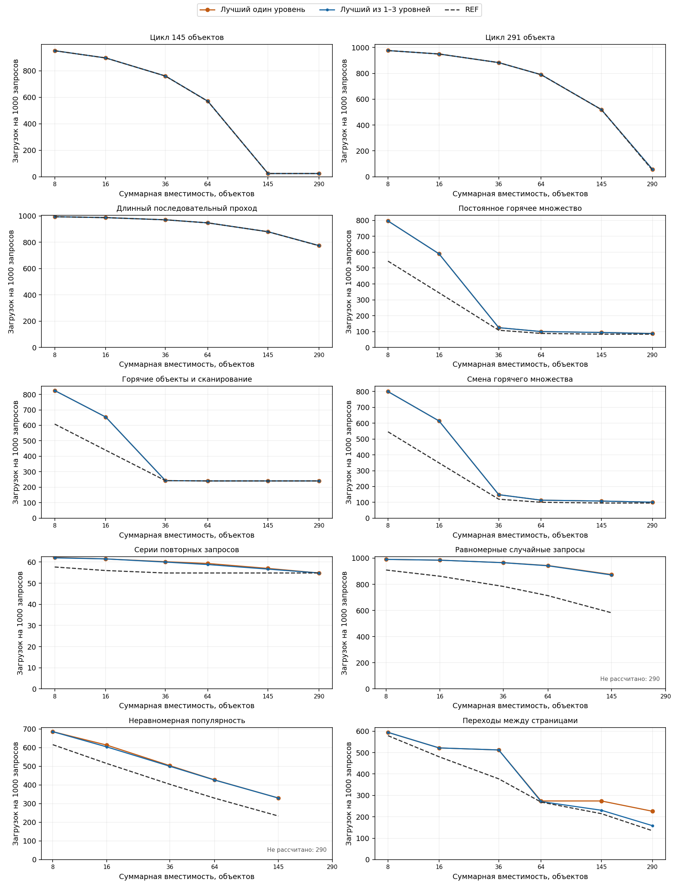
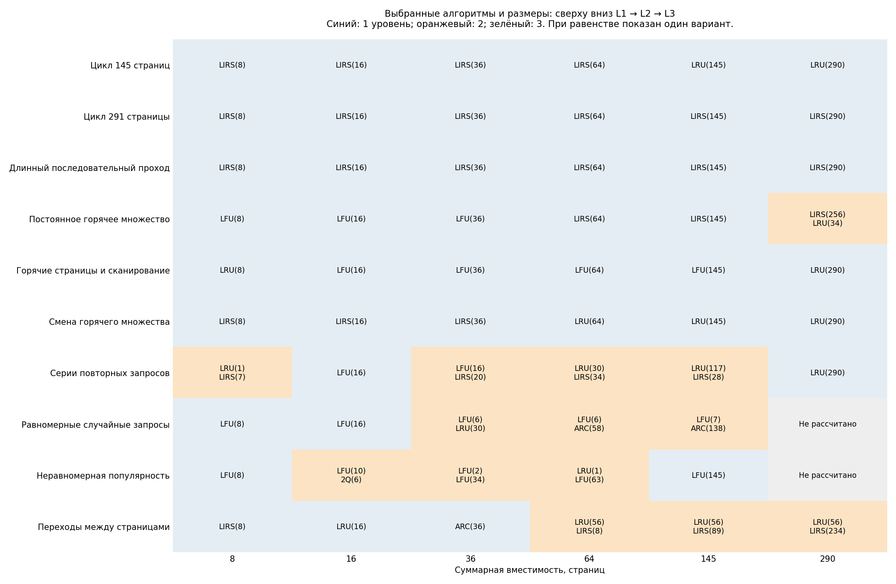

# Cache Research

- [Описание проекта](#описание-проекта)
- [Исследование №1: Влияние размера одноуровневого кеша на выбор алгоритма вытеснения](#исследование-1-влияние-размера-одноуровневого-кеша-на-выбор-алгоритма-вытеснения)
- [Исследование №2: Поиск оптимальной системы в приближении к процессорной иерархии кеша](#исследование-2-поиск-оптимальной-системы-в-приближении-к-процессорной-иерархии-кеша)
  - [Наиболее оптимальные сочетания алгоритмов](#наиболее-оптимальные-сочетания-алгоритмов)
  - [Даёт ли сочетание алгоритмов выигрыш](#даёт-ли-сочетание-алгоритмов-выигрыш)
- [Исследование №3: Бесплатный доступ к уровням](#исследование-3-бесплатный-доступ-к-уровням)
- [Общий вывод](#общий-вывод)
- [Сборка и запуск](#сборка-и-запуск)
  - [1. Подготовка](#1-подготовка)
  - [2. Сборка бенчмарков](#2-сборка-бенчмарков)
  - [3. Запуск экспериментов](#3-запуск-экспериментов)
  - [4. Собственная последовательность запросов](#4-собственная-последовательность-запросов)
  - [5. Сборка и запуск тестов](#5-сборка-и-запуск-тестов)
  - [6. Запуск собственной системы](#6-запуск-собственной-системы)

## Описание проекта

Данный проект посвящен исследованию алгоритмов кеширования **LRU (least recently used), LFU (least frequently used), ARC (adaptive replacement cache), 2Q (two queue) и LIRS (low-inference recency set)**, а также многоуровневых систем, включающих данные алгоритмы с целью нахождения оптимальной системы при различных паттернах использования.

[Описания алгоритмов вытеснения и паттернов использования кеша](cacheBenchmarks/reports/METHODOLOGY.md)

Во всех исследованиях использовались страницы одинакового размера, кеши изначально были пусты, первые загрузки учитывались.

**Горячее множество** — набор часто запрашиваемых страниц.
**REF** — идеальный алгоритм кеширования, заранее знающий будущие запросы и вытесняющий ту страницу, которая встретится позже других.
Данный алгоритм использовался как эталонный для сравнения с построенными нами системами.

В таблицах **производительность, % от REF**: **100% — производительность REF; чем выше процент и ближе к 100%, тем лучше.**
Для исходного числа загрузок и стоимости запроса **меньше — лучше**.

## Исследование №1: Влияние размера одноуровневого кеша на выбор алгоритма вытеснения

**Задача:** выявление оптимального алгоритма при заданной вместимости кеша и количеству обращений.

Проверены 30 различных вместимостей и 10 видов запросов: по 20 000 обращений и пять
начальных значений генератора случайных страниц. Метрика — среднее число загрузок из источника
на 1000 запросов; время поиска в кеше не учитывается.

На графиках по горизонтали — вместимость кеша в логарифмическом масштабе,
по вертикали — количество загрузок на 1000 запросов. Пунктир обозначает идеальный алгоритм кеширования REF.


**Лидеры при трёх характерных размерах.** В ячейке указаны наиболее оптимальные алгоритмы
и их производительность в процентах от REF при той же вместимости.

| Запросы \ Вместимость кеша | 32 страницы. % от REF | 64 страницы. % от REF | 290 страниц.% от REF |
|---|---|---|---|
| Цикл 145 страниц | LIRS — 99.80 | LIRS — 99.45 | ARC, LFU, LIRS, LRU — 100.00 |
| Цикл 291 страниц | LIRS — 100.00 | LIRS — 100.00 | LIRS — 72.76 |
| Длинный последовательный проход | LIRS — 100.00 | LIRS — 100.00 | LIRS — 99.83 |
| Постоянное горячее множество | LFU — 63.88 | LFU — 84.22 | LFU — 69.28 |
| Горячие страницы и сканирование | LIRS — 82.52 | ARC, LFU, LIRS — 100.00 | ARC, LFU, LIRS, LRU — 100.00 |
| Смена горячего множества | LIRS — 63.05 | LRU — 85.32 | LFU — 73.61 |
| Серии повторных запросов | ARC, LIRS, LRU — 84.12 | LFU — 79.32 | LFU — 78.38 |
| Равномерные случайные запросы | ARC — 81.80 | ARC — 74.75 | LIRS — 53.88 |
| Неравномерная популярность | LFU — 81.92 | LFU — 76.00 | LFU — 62.39 |
| Переходы между страницами | LRU — 76.06 | LRU — 97.94 | LFU — 53.63 |

**Вывод:** Универсального победителя нет.Размер кеша нужно выбирать вместе с алгоритмом под конкретные запросы.
Например, при смене горячего множества
с увеличением вместимости лучший алгоритм меняется с LIRS на LRU, затем
на LFU. При постоянном горячем множестве LFU выигрывает при всех исследуемых значениях вместимости.

[Подробные результаты](cacheBenchmarks/reports/software.md) ·
[Сводная таблица](cacheBenchmarks/reports/software/summary.csv)

## Исследование №2: Поиск оптимальной системы в приближении к процессорной иерархии кеша

**Задача:** найти оптимальную систему распределения памяти и алгоритмов между тремя уровнями кеша.

Общий объём — 290 страниц, ограничения размеров кеша по уровням: L1 ≤ 4, L2 ≤ 64, L3 ≤ 256.
Проверены восемь разбиений и восемь видов запросов, по 20 000 обращений
и пять начальных значений генератора случайных страниц.

Обращения к L1, L2 и L3 стоят 1, 3 и 10 условных единиц соответственно, загрузка из памяти — ещё 50. Затраты складываются: попадание в L3 стоит 14, полный промах — 64.
Метрикой является средняя стоимость запроса в условных единицах.

### Наиболее оптимальные сочетания алгоритмов

В таблицу приведены победители среди всех проверенных разбиений. Алгоритмы перечислены от L1 к L3.

| Запросы | L1+L2+L3, страниц | Алгоритмы L1+L2+L3 | Средняя стоимость | Производительность, % от REF |
|---|---|---|---:|---:|
| Цикл 145 страниц | 4+64+222 | LIRS+LIRS+ARC | 9.781 | 13.93 |
| Цикл 291 страниц | 4+64+222 | LIRS+LIRS+LIRS | 13.464 | 14.07 |
| Длинный последовательный проход | 4+64+222 | LIRS+LIRS+LIRS | 51.465 | 75.23 |
| Постоянное горячее множество | 4+48+238 | LFU+LFU+LFU | 8.830 | 43.20 |
| Горячие страницы и сканирование | 4+48+238 | 2Q+ARC+2Q | 18.831 | 72.06 |
| Смена горячего множества | 4+64+222 | LIRS+LRU+LIRS | 9.945 | 44.98 |
| Серии повторных запросов | 1+64+225 | ARC+LFU+LIRS | 4.255 | 68.48 |
| Равномерные случайные запросы | 4+64+222 | LFU+LFU+LIRS | 51.279 | 41.47 |

### Даёт ли сочетание алгоритмов выигрыш

Зафиксируем размеры уровней: L1 = 2, L2 = 32, L3 = 256 страниц. Сравним лучший одинаковый алгоритм с лучшим сочетанием алгоритмов при этом разбиении:

| Запросы | Лучший одинаковый алгоритм | Лучшая однотипная система, % от REF | Лучшая многоуровневая система,  % от REF |
|---|---|---:|---:|
| Цикл 145 страниц | LIRS | 11.21 | 11.21 |
| Цикл 291 страниц | LIRS | 13.02 | 13.02 |
| Длинный последовательный проход | LIRS | 74.93 | 74.93 |
| Постоянное горячее множество | LFU | 38.68 | 38.74 |
| Горячие страницы и сканирование | LFU | 69.29 | 69.31 |
| Смена горячего множества | ARC | 38.68 | 40.45 |
| Серии повторных запросов | LFU | 68.12 | 68.46 |
| Равномерные случайные запросы | LFU | 41.12 | 41.30 |

**Вывод:** Сочетание разных алгоритмов полезно не для каждой нагрузки.
При фиксированных размерах 2+32+256 и смене горячего множества оно повышает
производительность с 38,68% от REF у алгоритма ARC до 40,45% от REF.
Для обоих циклов и длинного последовательного прохода выигрыша нет.

[Сводная таблица](cacheBenchmarks/reports/hierarchy/summary.csv)

## Исследование №3: Бесплатный доступ к уровням

**Задача:** исследовать влияние разбиения фиксированного объёма памяти на число загрузок кеша.

В рамках исследования считаем обращения к кешам бесплатными; перебираются все целочисленные разбиения на 1–3
уровня и сочетания пяти алгоритмов. Общая вместимость кеша — 8, 16, 36, 64, 145 и 290
страниц.

На графике синяя линия — лучший вариант из кешей с 1–3 уровнями, оранжевая — лучший
кеш с одним уровнем, пунктир — REF. По горизонтали — общая вместимость кеша в логарифмическом
масштабе, по вертикали — количество загрузок на 1000 запросов.



**Лучшие конфигурации при различных значениях общей вместимости кеша.** Диаграмма отражает наиболее оптимальные сочетания
алгоритмов и размеров уровней от первого к последнему; различными цветами обозначены кеши с различным числом уровней. Например, LRU(56) → LIRS(234) — два уровня на 56 и 234 страницы.
При равенстве показан один выбранный вариант с минимальным числом уровней.



**Наиболее оптимальные системы:**

| Запросы | Общая вместимость кеша | Лучшая система | Производительность лучшей системы, % от REF | Производительность лучшей одноуровневой системы, % от REF |
|---|---:|---|---:|---:|
| Цикл 291 страницы | 290 | LIRS(290) | 89,08 | 89,08 |
| Смена горячего множества | 290 | LRU(290) | 94,56 | 94,56 |
| Постоянное горячее множество | 290 | LIRS(256) → LRU(34) | 95,62 | 94,72 |
| Неравномерная популярность | 36 | LFU(2) → LFU(34) | 80,69 | 80,16 |
| Переходы между страницами | 64 | LRU(56) → LIRS(8) | 99,08 | 98,05 |
| Переходы между страницами | 145 | LRU(56) → LIRS(89) | 93,06 | 78,35 |
| Переходы между страницами | 290 | LRU(56) → LIRS(234) | 85,08 | 59,73 |

**Вывод:** Разбиение фиксированного объема памяти на несколько уровней кешей с различными алгоритмами может существенно влиять на число загрузок. Самый заметный выигрыш — переходы между страницами при объёме 290:
85,08% производительности REF для системы LRU(56) → LIRS(234) вместо 59,73% от REF для одноуровневой системы.
Во всех **58 рассчитанных сочетаниях** одного или двух уровней достаточно:
третий не улучшает минимум количества запросов.

[Подробные результаты](cacheBenchmarks/reports/unrestricted.md) ·
[Сводная таблица](cacheBenchmarks/reports/unrestricted/summary.csv) ·

## Общий вывод

Были проведены 3 иследования, по их результатам выяснилось, что подходящая стратегия определяется совместно:
характером запросов, вместимостью, стоимости cache miss и самой модели. Разные алгоритмы
на уровнях иногда дают заметную экономию (LIRS оказывался среди лидеров по результатам бенчей при различных паттернах и может быть отличной страгией для разных ситуаций), но сам факт их различия
не означает существенного или устойчивого преимущества.

## Сборка и запуск

Все команды выполняются **из корня репозитория**.

### 1. Подготовка

Нужны компилятор C++17, CMake 3.24 или новее, Ninja и Python 3.
В примерах Python запускается командой `python`; если в системе используется
`python3`, замените её во всех командах.

Инициализируйте подмодули и установите библиотеку графиков:

```sh
git submodule update --init --recursive
python -m pip install matplotlib
```

### 2. Сборка бенчмарков

```sh
cmake --preset release
cmake --build --preset release --target cache_benchmark_runner cache_exact_search cache_tests --parallel
```

Задайте переменные для последующих
команд:

**Windows, PowerShell:**

```powershell
$buildDir = "build/Windows/release"
$runner = "$buildDir/cache_benchmark_runner.exe"
$exact = "$buildDir/cache_exact_search.exe"
```

**Linux, Bash:**

```bash
buildDir="build/Linux/release"
runner="$buildDir/cache_benchmark_runner"
exact="$buildDir/cache_exact_search"
```

Дальнейшие команды с `"$runner"`, `"$exact"` и `"$buildDir"` работают
с этими переменными. Если сборка уже находится в другом каталоге, например
`build/Windows/research`, укажите его в переменных.

### 3. Запуск экспериментов

Примеры сохраняют новые результаты в `build/bench-results/`.

#### Запуск исследования №1: Влияние размера одноуровневого кеша на выбор алгоритма вытеснения

```sh
python cacheBenchmarks/cache_research.py --mode software --runner "$runner" --root build/bench-results
```

По умолчанию: 30 вместимостей, 10 видов запросов, 20 000 обращений
и пять начальных значений генератора. Результаты — в `build/bench-results/software/`.

#### Запуск исследования №2: Поиск оптимальной системы в приближении к процессорной иерархии кеша

```sh
python cacheBenchmarks/cache_research.py --mode hierarchy --runner "$runner" --root build/bench-results
```

По умолчанию: три уровня, общий объём 290 страниц, пределы вместимости
4/64/256, восемь видов запросов, 20 000 обращений и пять начальных
значений генератора. Результаты — в `build/bench-results/hierarchy/`.

##### Доступные параметры:

| Параметр `cache_research.py` | Назначение |
|---|---|
| `--mode software\|hierarchy\|all` | Исследование №1, №2 или оба; по умолчанию `all`. Исследование №3 запускается отдельно через `cache_unrestricted.py` |
| `--root PATH` | Общая папка результатов; без указания — `cacheBenchmarks/reports` |
| `--requests N` | Число запросов; по умолчанию 20 000 |
| `--seeds N ...` | Начальные значения генератора; по умолчанию 1 2 3 4 5 |
| `--sizes N ...` | Вместимости одноуровневого кеша |
| `--total N` | Общая вместимость иерархии; по умолчанию 290 |
| `--level-limits N N N` | Верхние границы размеров L1, L2 и L3 |
| `--l1-sizes N ..., --l2-sizes N ...` | Проверяемые размеры первых двух уровней; L3 получает остаток |
| `--workload-scale N` | Масштаб генерации запросов; по умолчанию 290, независимо от вместимости кеша |
| `--trace PATH` | Собственная последовательность для режима `software` |
| `--generate-only` | Сохранить план опыта без запуска симулятора |

#### Запуск исследование №3: Бесплатный доступ к уровням

По умолчанию проверяются общие объёмы 8, 16, 36, 64, 145 и 290,
от одного до трёх уровней, 10 видов запросов и последовательности
из 6000 обращений с начальным значением 1.
Точный поиск на больших объёмах может занимать много времени.

Запуск полной серии:

```sh
python cacheBenchmarks/cache_unrestricted.py --runner "$exact" --output build/bench-results/unrestricted
```
##### Доступные параметры:

| Параметр `cache_unrestricted.py` | Назначение |
|---|---|
| `--output PATH` | Папка этой серии; без указания — `cacheBenchmarks/reports/unrestricted` |
| `--patterns NAME ...` | Виды запросов, например `uniform popular navigation`; полный список — в `--help` |
| `--totals N ...` | Общие вместимости |
| `--max-levels 1\|2\|3` | Максимальное число уровней; по умолчанию 3 |
| `--requests N`, `--seeds N ...` | Длина и начальные значения последовательностей для подбора |
| `--workload-scale N` | Масштаб генерации запросов; по умолчанию 290 |
| `--workers N` | Число одновременно рассчитываемых видов запросов; по умолчанию 2 |

#### Проверка выбранных конфигураций и пересчёт графиков

После завершённого поиска можно сравнить выбранные конфигурации на новых
последовательностях без повторного подбора:

```sh
python cacheBenchmarks/cache_unrestricted.py --validate-with "$runner" --validation-seeds 2 3 --output build/bench-results/unrestricted
```

Начальные значения проверки должны отличаться от использованных при подборе.
Результат сохраняется в `validation.csv`.

Пересчитать сводную таблицу и рисунки по сохранённым результатам:

```sh
python cacheBenchmarks/cache_unrestricted.py --render-only --output build/bench-results/unrestricted
```

### 4. Собственная последовательность запросов

Собственный файл запросов поддерживается **только в исследовании №1**:
для `cache_research.py` нужно явно указать `--mode software` вместе с `--trace PATH`.
Режимы `--mode hierarchy` и `--mode all` не принимают `--trace`.
Исследование №3 запускается скриптом `cache_unrestricted.py`, у которого
нет параметров `--mode` и `--trace`; режима `--mode unrestricted` нет.
Для исследований №2 и №3 эти скрипты используют встроенные генераторы запросов.

Создайте текстовый файл, например `requests.txt`:

```text
a b a c b d a
```

Каждое слово обозначает объект; одинаковые слова — один и тот же объект.
Количество запросов в начале файла указывать не нужно.

```sh
python cacheBenchmarks/cache_research.py --mode software --runner "$runner" --trace requests.txt --sizes 2 4 8 --root build/custom-trace
```

Здесь `--sizes 2 4 8` задаёт вместимости одноуровневого кеша. Для каждой
вместимости сравниваются поддерживаемые алгоритмы вытеснения.
Результаты сохраняются в `build/custom-trace/software/`.

Последовательность используется целиком. Параметры `--requests` и `--seeds`
не меняют запросы из файла.

### 5. Сборка и запуск тестов

#### Сборка тестов

**Windows, PowerShell:**

```powershell
cmake --preset debug
cmake --build --preset debug
```

**Linux, Bash:**

```bash
cmake --preset debug
cmake --build --preset debug
```

#### Запуск всех тестов

**Windows, PowerShell:**

```powershell
ctest --test-dir build/Windows/debug --output-on-failure
```

**Linux, Bash:**

```bash
ctest --test-dir build/Linux/debug --output-on-failure
```

#### Запуск конкретной группы тестов

Например, для запуска тестов группы `CacheREF`:

**Windows, PowerShell:**

```powershell
& ".\build\Windows\debug\cache_tests.exe" --gtest_filter="CacheREF*"
```

**Linux, Bash:**

```bash
"./build/Linux/debug/cache_tests" --gtest_filter="CacheREF*"
```

### 6. Запуск собственной системы

Перед сборкой создайте в корне папки `configs/` и `inputs/`:
CMake копирует их в каталог приложения. Сохраните в них следующие файлы.

`configs/config_1.txt` — число уровней и алгоритмы сверху вниз:

```text
4
LFU
LRU
LIRS
2Q
```

`inputs/input_1.txt` — вместимости уровней, число запросов и идентификаторы:

```text
3 4 5 7
5
1 2 3 2 1
```

```sh
cmake --build --preset release --target cache_research --parallel
```

**Windows, PowerShell:**

```powershell
& "$buildDir/bin/Release/cache_research.exe" configs/config_1.txt inputs/input_1.txt
```

**Linux, Bash:**

```bash
"$buildDir/bin/Release/cache_research" configs/config_1.txt inputs/input_1.txt
```

Количество вместимостей должно совпадать с количеством уровней, а число
идентификаторов — с заявленным количеством запросов.
