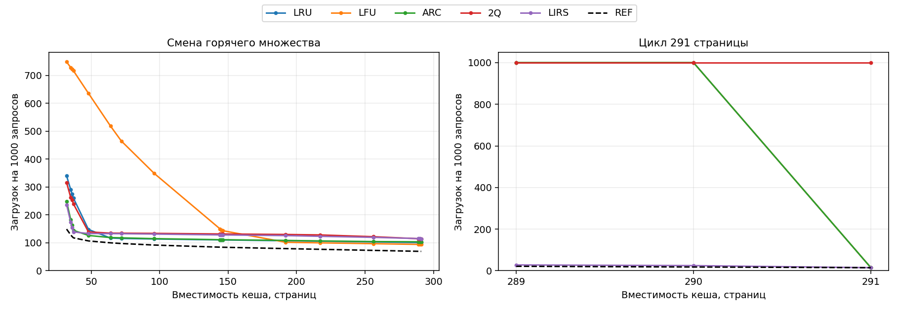

# Обзор экспериментов с кешированием

[Оглавление](README.md) · [Методика и определения алгоритмов](methodology.md)

Исследование рассматривает два связанных вопроса: как вместимость кеша влияет
на выбор алгоритма вытеснения и когда разделение памяти на несколько уровней
позволяет улучшить результат. Сравниваются LRU, LFU, ARC, 2Q и LIRS.
Алгоритм вытеснения определяет, какой объект удалить из заполненного кеша.

Проведены три эксперимента с разными условиями и критериями качества.

| Эксперимент | Модель | Что меняется | Критерий качества |
|---|---|---|---|
| [Влияние размера кеша на выбор алгоритма вытеснения](software.md) | Один кеш объектов одинакового размера | Вместимость и алгоритм вытеснения | Число загрузок из источника |
| [Иерархия, приближённая к процессорной](hierarchy.md) | Три уровня с ограниченной вместимостью и возрастающей стоимостью обращения | Распределение 290 страниц и алгоритмы на уровнях | Средняя стоимость запроса |
| [Иерархия с бесплатным обращением к уровням](unrestricted.md) | От одного до трёх уровней без ограничений на размер отдельного уровня | Общий объём, его разбиение и алгоритмы | Число загрузок из источника |

Объекты во всех моделях имеют одинаковый размер. Вместимость означает число
мест для объектов; память для служебных структур алгоритмов в неё не входит.
В начале каждой последовательности кеши пусты, поэтому первые загрузки
учитываются в результате. Запросы искусственные: циклы, последовательные проходы,
обращения к часто используемому набору, смена этого набора, серии повторений
и случайный выбор объектов. В одноуровневом кеше и в иерархии с бесплатным обращением к уровням
дополнительно проверяются два вида запросов: в первом одни объекты запрашиваются
чаще других, во втором имитируются переходы между веб-страницами.
У страниц есть как собственные, так и общие ресурсы, поэтому при переходах
часть ресурсов запрашивается повторно.

## 1. Влияние размера кеша на выбор алгоритма вытеснения

### Условия

Один кеш хранит объекты, запрашиваемые приложением. Если объекта в нём нет,
происходит загрузка из внешнего источника. Стоимость поиска в кеше не учитывается.
Основная метрика — **загрузки на 1000 запросов**: меньшее значение означает
больше запросов, обслуженных кешем.

Проверены 30 размеров и 10 видов запросов. Каждая последовательность содержит
20 000 запросов; результаты усредняются по пяти начальным значениям генератора.
При сравнении алгоритмов и размеров используются одинаковые последовательности.

### Вместимость влияет на выбор алгоритма

При смене часто используемого набора каждые 2000 запросов победитель зависит
от размера кеша:

| Вместимость | Лучший алгоритм | Загрузок на 1000 запросов |
|---:|---|---:|
| 32 объекта | LIRS | 236,64 |
| 64 объекта | LRU | 117,22 |
| 290 объектов | LFU | 94,37 |

Однако размер сам по себе не определяет победителя. При вместимости 32 объекта
и постоянном часто используемом наборе лучшим оказался LFU.
**Выбор зависит одновременно от вместимости и характера запросов.**

Важны также размеры, при которых весь повторяющийся набор начинает помещаться
в кеше. Для цикла из 291 объекта увеличение вместимости LRU с 290 до 291
уменьшает число загрузок с 1000 до 14,55 на 1000 запросов. После первых
291 загрузки все обращения обслуживаются из кеша.

### Увеличение вместимости не всегда улучшает результат конкретного алгоритма

В последовательности переходов между страницами исследуемая реализация LFU
дала 501,80 загрузки на 1000 запросов при вместимости 48, 658,00 при вместимости
64 и 441,00 при вместимости 96. Изменение размера влияет на историю содержимого
кеша и последующие вытеснения; для этой реализации результат оказался немонотонным.

Следовательно, оценивать алгоритм нужно на диапазоне размеров.
Победа при одной вместимости не гарантирует преимущества при другой.

## 2. Иерархия, приближённая к процессорной

### Условия

Используется упрощённая модель процессорной иерархии: ближайший уровень
мал и дёшев в обращении, следующие уровни вместительнее, но дороже.
Промах на верхнем уровне приводит к дополнительным затратам на обращение
к нижнему.

Общий объём равен **290 страницам**. Отношению размеров **1:16:128**
соответствует разбиение **2+32+256**. Вместимости ограничены:
**L1 ≤ 4, L2 ≤ 64, L3 ≤ 256**. Рассмотрены восемь допустимых разбиений
и все поддерживаемые сочетания пяти алгоритмов. Для восьми видов запросов
используются последовательности по 20 000 обращений и пять начальных
значений генератора.

Обращения к L1, L2 и L3 стоят соответственно **1, 3 и 10** условных единиц;
загрузка из внешней памяти — ещё **50**. Затраты складываются по пройденным
уровням: попадание в L3 стоит 14, промах на всех уровнях — 64.
Основная метрика — **средняя стоимость запроса**.

Приближение к процессору состоит в ограничениях вместимости и различии
стоимости доступа. Эти числа задают условия модели и не являются измеренными
задержками конкретного процессора. 

### Лучшее сочетание зависит от запросов

При смене часто используемого набора лучший из проверенных вариантов —
**LIRS(4) → LRU(64) → LIRS(222)** со средней стоимостью **9,945**.
При постоянном часто используемом наборе —
**LFU(4) → LFU(48) → LFU(238)** со стоимостью **8,830**.

Здесь запись LIRS(4) обозначает алгоритм LIRS и вместимость четыре страницы,
а стрелки задают порядок уровней. Сравнивать эти два значения как преимущество
одного сочетания над другим нельзя: они получены на разных запросах.

При фиксированном разбиении **2+32+256** можно отдельно сравнить выбор
алгоритмов для разных видов запросов:

Каждая строка показывает одно лучшее сочетание целиком. Нижний уровень получает
только промахи верхнего, поэтому алгоритмы на уровнях нельзя выбирать независимо.

## 3. Иерархия с бесплатным обращением к уровням

### Условия

В этой модели попадание на любом уровне имеет нулевую стоимость.
Учитывается только загрузка из источника при отсутствии объекта во всех кешах.

Проверяются общие объёмы **8, 16, 36, 64, 145 и 290 объектов**,
от одного до трёх уровней и пять алгоритмов на каждом уровне.
Для каждой пары «вид запросов — общий объём» ищется точный минимум среди
допустимых конфигураций. При равном числе загрузок выбирается меньшее
число уровней.

Для подбора используется одна последовательность из 6000 запросов на каждый
вид нагрузки. Результаты имеются для 58 пар; для равномерных случайных запросов
и неравномерной популярности при объёме 290 данных нет т.к. слишком тяжелый случай в вычислениях.

### Разделение памяти может уменьшить число загрузок

Для переходов между страницами получены следующие результаты:

| Общая вместимость | Лучший выбранный вариант | Загрузок за 6000 запросов | Загрузок у лучшего одного уровня |
|---:|---|---:|---:|
| 64 | LRU(56) → LIRS(8) | 1627 | 1644 |
| 145 | LRU(56) → LIRS(89) | 1384 | 1644 |
| 290 | LRU(56) → LIRS(234) | 952 | 1356 |

При объёме 290 разделение памяти экономит **404 загрузки**.
Первый уровень обслуживает 4356 запросов, второй — ещё 692;
952 запроса требуют обращения к источнику.

**Во всех 58 исследованных парах лучший результат достигается одним или
двумя уровнями.** Третий уровень не уменьшает число загрузок относительно
лучшего варианта с меньшим числом уровней. Этот вывод относится к выбранным
алгоритмам, размерам и последовательностям; он не доказывает, что три уровня
бесполезны при любых условиях.

## Сопоставление моделей и границы выводов

В одноуровневой и свободной многоуровневой моделях важна частота загрузок
из источника. В процессорной модели важен также уровень попадания:
одинаковое число загрузок может сопровождаться разной стоимостью запросов.
Поэтому результаты трёх экспериментов нельзя объединить в единый рейтинг.

**REF** — идеальный алгоритм, знающий будущие запросы. При бесплатном обращении
к уровням REF на весь общий объём задаёт нижнюю границу числа загрузок:
объединение содержимого уровней не может вместить больше разных объектов,
чем сумма их вместимостей. В процессорной модели такой одноуровневый эталон
не описывает идеальную иерархию с разными стоимостями доступа.

Процент от REF равен 100 при совпадении результатов; 150 означает значение
метрики в полтора раза больше эталонного. Он характеризует результат
относительно идеального предела, но не заменяет основную метрику.

### Общий результат экспериментов 
подходящая стратегия определяется совместно
характером запросов, вместимостью и моделью стоимости. Разные алгоритмы
на уровнях иногда дают заметную экономию, но сам факт их различия
не означает существенного или устойчивого преимущества.
