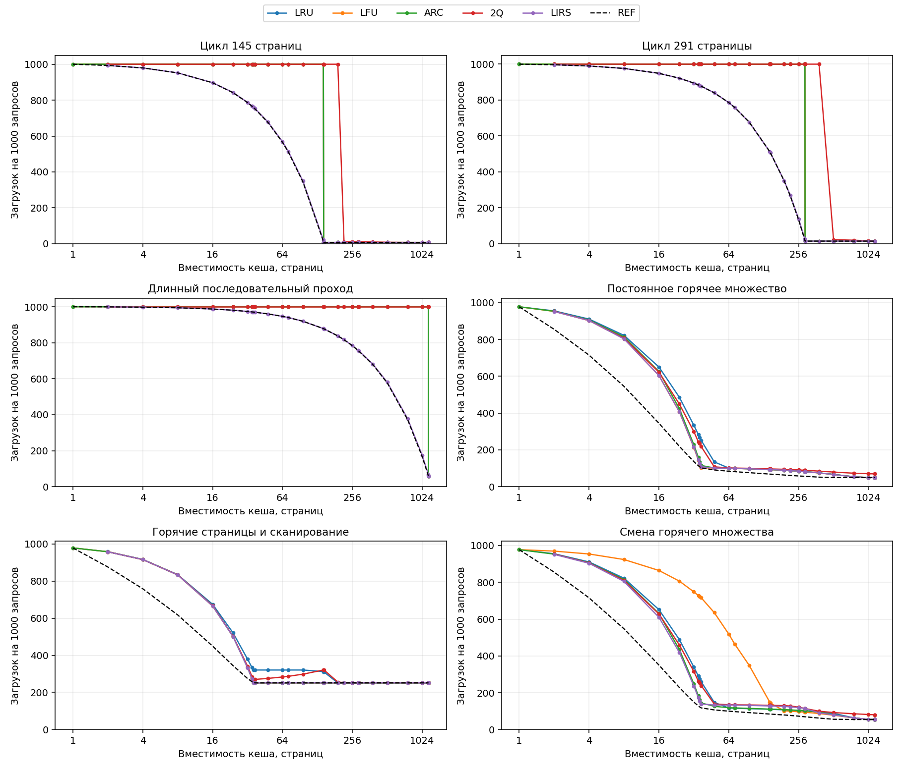
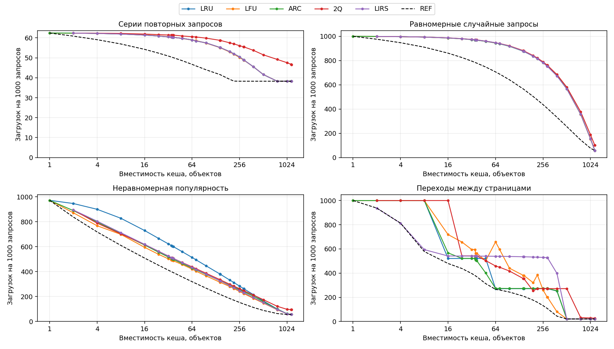

# Влияние размера кеша на выбор алгоритма вытеснения
[Основной README](../../README.md) · [Основные выводы](CONCLUSIONS.md)

В каждом запуске кеш обрабатывает 20 000 запросов к объектам. Последовательность запросов — это список объектов в том порядке, в котором к ним обращаются; один объект может встречаться много раз.
Для каждого вида запросов тест повторяется пять раз. В генератор случайных чисел по очереди передаются начальные значения 1, 2, 3, 4 и 5. Они задают воспроизводимые варианты запросов: при том же начальном значении генератор создаёт тот же список. Если в запросах нет случайности, все пять списков совпадают.

При каждом запуске кеш пуст. Первые загрузки тоже входят в результат.
Для сравнения размеров и алгоритмов используется одна и та же последовательность запросов.
Для каждого вида запросов и размера кеша победителем считается алгоритм с наименьшим средним числом загрузок за пять запусков. Если несколько алгоритмов делят лучший результат, в столбце «Лучшие алгоритмы» перечислены все они.

**Алгоритм вытеснения** выбирает, какой объект удалить, когда кеш заполнен.
**Горячее множество** — небольшой набор объектов, к которым обращаются часто.
**Промах** означает, что объекта в кеше нет и его нужно загрузить из источника.
**REF** знает все будущие запросы и удаляет объект, который понадобится позже остальных. Он нужен для сравнения; использовать его в обычной программе невозможно.

## Что измеряем

Кеш хранит объекты одинакового размера. На промахе выполняется одна загрузка. Иерархии и штрафа за размер здесь нет.
**Загрузки на 1000 запросов** — основная метрика. Например, 80 означает, что из 1000 запросов примерно 80 потребовали загрузки, а 920 обслужил кеш. Меньше лучше.
**Загрузки, % от REF** = 100 × число загрузок алгоритма / число загрузок REF при той же вместимости. 100% означает равенство, 150% — загрузок в полтора раза больше.
При разных размерах объектов или разной цене загрузки этих метрик уже недостаточно.
[Описание алгоритмов и всех видов запросов](METHODOLOGY.md).

## Как читать графики

Каждая линия соответствует одному алгоритму. По горизонтали — число объектов, которые помещаются в кеш; по вертикали — число загрузок на 1000 запросов.
Горизонтальная ось имеет логарифмический масштаб: равные отрезки на ней соответствуют увеличению размера кеша в одинаковое число раз. Чем ниже проходит линия алгоритма, тем меньше загрузок он выполняет и тем лучше его результат. Для сравнения пунктиром показаны результаты REF.
Пересечение линий означает, что преимущество алгоритмов меняется с размером. Совпадающие линии могут перекрывать друг друга.

## Несколько размеров из полной серии

В таблицах показаны средние результаты. Полный набор размеров — в summary.csv.
При небольшом числе запусков малое различие может оказаться случайным.

### Цикл 145 объектов

| Размер кеша | Лучшие алгоритмы | Загрузок / 1000 | Загрузки, % от REF |
|---:|---|---:|---:|
| 32 | LIRS | 787.65 | 100.20 |
| 36 | LIRS | 760.25 | 100.23 |
| 64 | LIRS | 568.45 | 100.56 |
| 145 | ARC, LFU, LIRS, LRU | 7.25 | 100.00 |
| 290 | ARC, LFU, LIRS, LRU | 7.25 | 100.00 |
| 291 | ARC, LFU, LIRS, LRU | 7.25 | 100.00 |

### Цикл 291 объекта

|  Размер кеша| Лучшие алгоритмы | Загрузок / 1000 | Загрузки, % от REF |
|---:|---|---:|---:|
| 32 | LIRS | 894.60 | 100.00 |
| 36 | LIRS | 881.00 | 100.00 |
| 64 | LIRS | 785.80 | 100.00 |
| 145 | LIRS | 510.40 | 100.00 |
| 290 | LIRS | 24.60 | 137.43 |
| 291 | ARC, LFU, LIRS, LRU | 14.55 | 100.00 |

### Длинный последовательный проход

| Объектов в кеше | Лучшие алгоритмы | Загрузок / 1000 | Загрузки, % от REF |
|---:|---|---:|---:|
| 32 | LIRS | 973.65 | 100.00 |
| 36 | LIRS | 970.25 | 100.00 |
| 64 | LIRS | 946.45 | 100.00 |
| 145 | LIRS | 877.60 | 100.00 |
| 290 | LIRS | 755.60 | 100.17 |
| 291 | LIRS | 754.80 | 100.17 |

### Постоянное горячее множество

| Объектов в кеше | Лучшие алгоритмы | Загрузок / 1000 | Загрузки, % от REF |
|---:|---|---:|---:|
| 32 | LFU | 212.66 | 156.55 |
| 36 | LFU | 121.96 | 113.70 |
| 64 | LFU | 99.56 | 118.74 |
| 145 | LFU | 92.64 | 135.94 |
| 290 | LFU | 81.27 | 144.35 |
| 291 | LFU | 81.19 | 144.34 |

### Горячие объекты и сканирование

| Объектов в кеше | Лучшие алгоритмы | Загрузок / 1000 | Загрузки, % от REF |
|---:|---|---:|---:|
| 32 | LIRS | 333.21 | 121.18 |
| 36 | LIRS | 253.30 | 100.00 |
| 64 | ARC, LFU, LIRS | 251.40 | 100.00 |
| 145 | ARC, LFU, LIRS | 251.40 | 100.00 |
| 290 | ARC, LFU, LIRS, LRU | 251.40 | 100.00 |
| 291 | ARC, LFU, LIRS, LRU | 251.40 | 100.00 |

### Смена горячего множества

| Объектов в кеше | Лучшие алгоритмы | Загрузок / 1000 | Загрузки, % от REF |
|---:|---|---:|---:|
| 32 | LIRS | 236.64 | 158.61 |
| 36 | LIRS | 155.07 | 126.41 |
| 64 | LRU | 117.22 | 117.21 |
| 145 | LRU | 110.27 | 130.82 |
| 290 | LFU | 94.37 | 135.85 |
| 291 | LFU | 94.27 | 135.90 |

### Серии повторных запросов

| Объектов в кеше | Лучшие алгоритмы | Загрузок / 1000 | Загрузки, % от REF |
|---:|---|---:|---:|
| 32 | ARC, LIRS, LRU | 60.51 | 118.88 |
| 36 | ARC, LIRS, LRU | 60.29 | 120.01 |
| 64 | LFU | 58.91 | 126.08 |
| 145 | LFU | 55.07 | 132.51 |
| 290 | LFU | 48.84 | 127.62 |
| 291 | LFU | 48.80 | 127.51 |

### Равномерные случайные запросы

| Объектов в кеше | Лучшие алгоритмы | Загрузок / 1000 | Загрузки, % от REF |
|---:|---|---:|---:|
| 32 | ARC | 971.68 | 122.25 |
| 36 | LRU | 968.45 | 123.92 |
| 64 | ARC | 944.50 | 133.78 |
| 145 | LRU | 875.39 | 155.33 |
| 290 | LIRS | 752.16 | 185.59 |
| 291 | LIRS | 751.43 | 185.81 |

### Неравномерная популярность

| Объектов в кеше | Лучшие алгоритмы | Загрузок / 1000 | Загрузки, % от REF |
|---:|---|---:|---:|
| 32 | LFU | 502.77 | 122.07 |
| 36 | LFU | 490.27 | 123.81 |
| 64 | LFU | 420.39 | 131.59 |
| 145 | LFU | 314.68 | 144.87 |
| 290 | LFU | 224.34 | 160.29 |
| 291 | LFU | 223.60 | 160.17 |

### Переходы между страницами

| Объектов в кеше | Лучшие алгоритмы | Загрузок / 1000 | Загрузки, % от REF |
|---:|---|---:|---:|
| 32 | LRU | 521.20 | 131.48 |
| 36 | ARC | 507.35 | 135.08 |
| 64 | LRU | 271.60 | 102.11 |
| 145 | LRU | 271.60 | 129.77 |
| 290 | LFU | 201.00 | 186.46 |
| 291 | LFU | 201.00 | 187.68 |